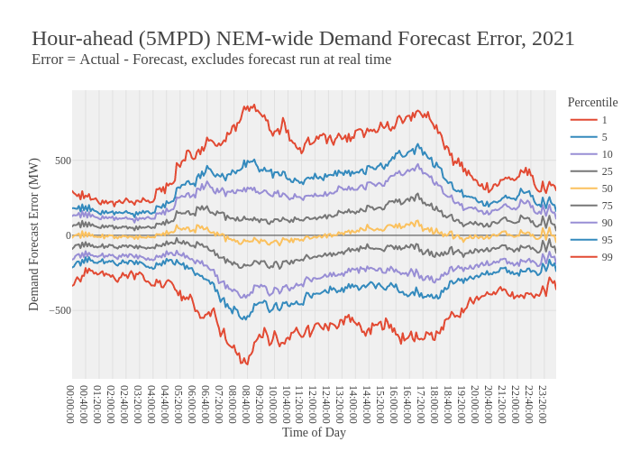

# Summary

In electrical power systems and their associated market frameworks, actions close to or during real-time (i.e. the time of power delivery) may be critical to ensuring that:

1. Supply and demand are balanced, and that the power system is operated within its technical envelope.
2. Market participants can maximise revenues from their generating and/or demand-side resources.

However, *real-time* actions and their outcomes are, to some degree, dependent on decisions made *ahead-of-time* — e.g. starting a gas turbine, charging a battery energy storage system and maintaining a greater level of spare capacity in reserve during periods of system stress. Given physical and financial uncertainties, no ahead-of-time decision is perfect; instead, they are made in light of the best available information, which includes demand, generation and market price forecasts [@maysPrivateRiskSocial2022].

Though the Australian National Electricity Market (NEM) lacks the ahead-of-time market platforms that are present in many restructured electricity industries in Europe and North America [@cramtonElectricityMarketDesign2017; @roquesEvolutionEuropeanModel2021], market participants provide resource and market offer information to the Australian Energy Market Operator (AEMO), which uses this submitted data alongside demand and renewable energy generation forecasts to run several centralised ahead-of-time processes [@australianenergymarketoperatorPredispatchOperatingProcedure2021; @australianenergymarketoperatorPreDispatch; @australianenergymarketoperatorReliabilityStandardImplementation2020]. These processes produce ahead-of-time information, or ["forecasts"](https://github.com/UNSW-CEEM/NEMSEER#user-content-fn-1-046877d6fabd7950d214da5f5dbc27c4), that market participants can use to inform their operational decision-making[^1], and that trigger AEMO to prepare for (or, in the worst case, undertake emergency actions before or during) periods of potential system risk [@australianenergymarketcommissionReserveServicesNational2021].

[^1]: That is, how they  participate in the central dispatch process that is used to clear the gross-pool markets in each region of the NEM.

`NEMSEER` is a Python 3 package that facilitates access to and analysis of *historical* ahead-of-time operational information from AEMO-run processes. Specifically, it enables users to download data from these processes, manipulate it using `pandas` [@mckinney-proc-scipy-2010; @reback2020pandas] or `xarray` [@Hoyer_xarray_N-D_labeled_2017] data structures, and cache the data in Parquet [@Parquet2023] or netCDF [@NetCDF2022] formats. Other major dependencies used by `NEMSEER` include `attrs` [@schlawackAttrs2022], `requests` [@PsfRequestsSimple] and `tqdm` [@costa-luisTqdmFastExtensible2023].

# Statement of need

AEMO publicly releases data from five of its operational ahead-of-time processes:

- 5-minute pre-dispatch
- Pre-dispatch
- Pre-dispatch Projected Assessment of System Adequacy
- Short Term Projected Assessment of System Adequacy
- Medium Term Projected Assessment of System Adequacy

However, significant effort and prerequisite knowledge is required to obtain and process this data for analysis. Firstly, a user must be familiar with how AEMO's data repositories are organised. Secondly, a user must have knowledge of what type of data each ahead-of-time process generates (i.e. the range of tables and columns available), and of each process' lookahead horizon (i.e. for a given time at which the process is *run*, what are the *forecasted* periods?). Finally, a user must download, unzip and clean CSV files  before being able to load and handle tables of interest using data analysis tools.

`NEMSEER` solves these issues by:

1. Providing learning resources and references (via the README and a [glossary](https://nemseer.readthedocs.io/en/latest/glossary.html) in the documentation) that unpack what each ahead-of-time process does and what data they offer.
2. Making it easier to download and handle this data. `NEMSEER` can inform the user of the date range of available data, which data tables are available and even generate the appropriate range of [run times](https://nemseer.readthedocs.io/en/latest/glossary.html#term-run-times) for a set of [forecasted times](https://nemseer.readthedocs.io/en/latest/glossary.html#term-forecasted-times) that a user is interested in. Once a user queries a subset of data, `NEMSEER` will download, unzip and process the CSV files into `pandas` or `xarray` data structures.

Furthermore, the package documentation contains examples (with Python code) that show how users can analyse demand forecast errors and energy price convergence using pre-dispatch demand and price forecast data (obtained using `NEMSEER`) and historical *actual* NEM system and market data (obtained using `NEMOSIS`) [@gormanNEMOSISNEMOpen2018]. \autoref{fig:p5demandforecasterror} is an output of one such [example](https://nemseer.readthedocs.io/en/latest/examples/p5min_demand_forecast_error_2021.html#plotting-forecast-error-quantiles-against-time-of-day).

{ width=80% }

`NEMSEER` use cases include:

- **Modelling system operator or market participant decision-making under uncertainty**. The latter could involve using pre-dispatch market price forecast data to understand the implications of using imperfect information to schedule energy storage systems (ongoing work by @prakashNEMStorageUnderUncertainty2022), or calculating price forecast errors that are used as inputs for stochastic modelling frameworks (e.g. @yurdakulOnlineCompanionRiskAverse2023).
- **Identifying periods of interest for market bidding behaviour analysis**. Significant divergence of the *actual* market price from *forecast* market prices (as explored in the [energy price convergence example](https://nemseer.readthedocs.io/en/latest/examples/price_convergence_2021.html)) might be due to participants changing their market offers as conditions change.
- **Obtaining specific NEM data that is only published in ahead-of-time datasets**. This includes some dynamic risk measures (e.g. capacity that would be lost in a credible contingency) and "sensitivities" that predict changes to market prices and interconnector flows across a range of demand changes in each market region of the NEM [@australianenergymarketoperatorPreDispatchSensitivities2021].

# Acknowledgements

We acknowledge contributions from Nicholas Gorman, Declan Heim and Dylan McConnell.

Development of `NEMSEER` was supported by the [UNSW Digital Grid Future Institute](https://www.dgfi.unsw.edu.au), and constitutes broader research work supported by an Australian Government Research Training Program Scholarship.

# References
